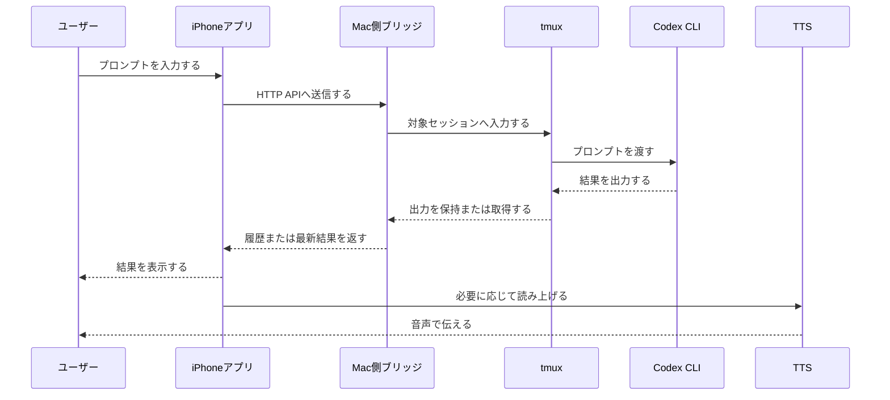

# System Overview

## 構成方針

`expo-sanpo` は、初期 PoC では iPhone アプリから Mac 側ブリッジへ HTTP で接続し、ブリッジが母艦の Mac 上の tmux セッションと Codex CLI を操作する構成にする。

Tailscale は iPhone と Mac 側ブリッジのネットワーク到達性を確保するために利用するが、VPN の構築や管理はこのプロジェクトの対象外とする。

SSH 直接接続は、Development Build が必要になった段階や、Mac 側ブリッジの運用負荷が問題になった段階で再検討する。

## 想定コンポーネント

| コンポーネント | 役割 | 備考 |
| --- | --- | --- |
| iPhone アプリ | プロンプト入力、結果表示、音声読み上げを提供する | React Native と Expo で実装する |
| Tailscale | iPhone から Mac 側ブリッジへ到達するためのネットワークを提供する | 対象外の前提インフラとして扱う |
| Mac 側ブリッジ | iPhone アプリから HTTP または WebSocket で受け取り、tmux と Codex CLI を操作する | Node.js と Hono で実装する |
| 母艦の Mac | Mac 側ブリッジ、tmux、Codex CLI を実行する開発環境 | 既存の開発環境と認証情報を利用する |
| tmux | Codex CLI を実行するセッションを維持する | 最終的には `tmux -CC` の control mode 利用を想定する |
| Codex CLI | 実際の作業を受け付けて実行する | tmux 上で起動する |
| TTS | Codex CLI の結果を音声で読み上げる | 初期は iPhone 側の `expo-speech` を候補にし、irodori-TTS などは後で判断する |
| Zod スキーマ | iPhone アプリと Mac 側ブリッジの API 契約を定義する | 共有パッケージに配置する |

## 想定フロー

## Mac 側ブリッジを使う理由

- Expo Go から HTTP で接続しやすい。
- iPhone アプリ内に SSH ネイティブライブラリを入れずに初期検証できる。
- iPhone 側に SSH 秘密鍵を持たせずに済む。
- tmux と Codex CLI の操作、履歴整形、TTS 用メッセージ整形を Mac 側に寄せられる。
- HTTP API で始め、リアルタイム出力が必要になった段階で WebSocket を追加できる。

## tmux を使う理由

- Codex CLI の実行状態を iPhone アプリや通信の切断から独立させられる。
- iPhone アプリ側で汎用ターミナルエミュレータを作る必要を減らせる。
- 既存の CLI 操作モデルを活かしながら、アプリ側をプロンプト送信と結果確認に寄せられる。

## tmux control mode の利用方針

最終的には、通常の画面キャプチャだけではなく、`tmux -CC` で起動できる control mode を使う方針とする。

control mode では、tmux にテキストプロトコルでコマンドを送り、標準出力からコマンド結果や `%output` などの通知を受け取れる。そのため、`tmux capture-pane` を定期実行して画面全体を読む構成よりも、ブリッジ側で出力差分を扱いやすくなる可能性がある。

初期検証では `tmux capture-pane` で十分に進めてもよいが、状態判定、差分取得、読み上げ重複の制御が問題になった段階で control mode を優先して検証する。

## 検討事項

- Mac 側ブリッジの認証トークンの渡し方。
- Mac 側ブリッジを Tailscale 内だけに公開する方法。
- tmux セッションの作成、再接続、一覧取得、出力取得の具体的な方法。
- `tmux -CC` の control mode で、Codex CLI の出力差分と状態をどこまで安定して扱えるか。
- Codex CLI の入力完了、実行中、完了、エラーをどう判定するか。
- TTS を iPhone 側で実行するか、Mac 側で音声生成してアプリへ渡すか。
- 散歩中の AI 雑談に適した応答長や読み上げ形式をどう制御するか。
- TTS が無い場合でも成立するテキスト中心の開発指示体験をどう設計するか。
- Mac 側ブリッジの通信は、初期 HTTP とし、tmux control mode の出力購読が必要になった段階で WebSocket を追加するか。
- 会話履歴は Mac 側ブリッジを正とし、iPhone アプリ側は表示用キャッシュに限定する。
- SSH 直接接続を将来的に再検討する条件をどう定めるか。
