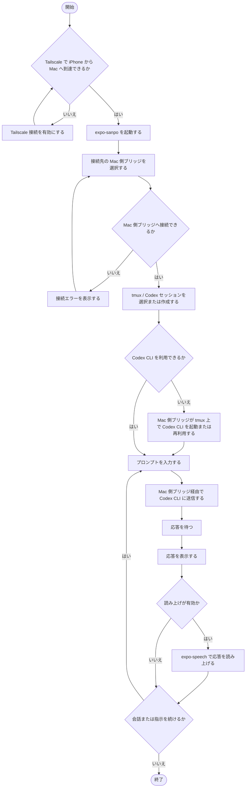

# Workflows

## 散歩中に Codex CLI へプロンプトを送る

このフローは、ユーザーが散歩中に iPhone から母艦の Mac 上の Codex CLI にプロンプトを送り、結果を確認する基本導線である。

Tailscale の設定や運用はプロジェクト対象外だが、利用前提としてフローに含める。

## 前提

- iPhone と母艦の Mac は Tailscale で到達可能である。
- 母艦の Mac では Mac 側ブリッジが起動している。
- 母艦の Mac には tmux と Codex CLI が導入されている。
- PoC では、Mac 側ブリッジの会話履歴はメモリに保持する。

## エラー時の扱い

| 状態 | 表示または対応 |
| --- | --- |
| Tailscale で到達できない | Tailscale 接続を確認するように表示する |
| Mac 側ブリッジへ接続できない | 接続先、ポート、認証トークンを確認するように表示する |
| tmux セッションを作成できない | Mac 側の tmux 状態を確認するように表示する |
| Codex CLI を起動できない | Mac 側の Codex CLI 設定を確認するように表示する |
| TTS が失敗する | テキスト表示は維持し、読み上げ失敗を通知する |

